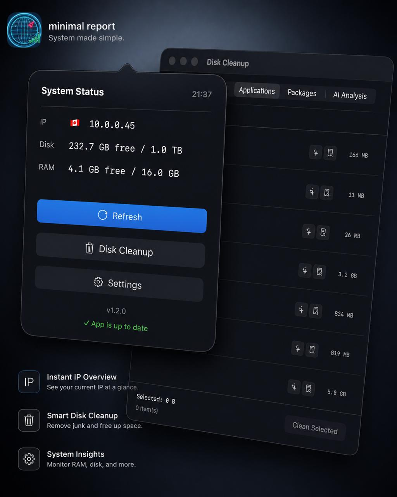

<div align="center">

# MinimalReport

**A powerful menu bar utility — public IP, system stats, smart disk cleanup, and AI-powered analysis.**

[](https://www.apple.com/macos/)
[](https://swift.org)
[](https://swift.org/package-manager/)
[](#)
[](LICENSE)

</div>

> **Platform support:** Only macOS is available right now. A Windows version is planned for a future release. All macOS source code is in the [`Mac/`](Mac/) folder.

---

<div align="center">
  
</div>

---

## What is MinimalReport?

MinimalReport is a **macOS menu bar app** — no dock icon, no Cmd+Tab entry, no bloat. Click the menu bar item to see your public IP, country, disk, RAM, and real-time network speed at a glance. Open the Disk Cleanup window to reclaim space across every package manager and app directory on your Mac. Then let the **AI engine** analyze your system and tell you exactly what to delete, what's safe, and where every app hides its cache.

```
Menu bar:   ↓ 12.4 KB/s ████  🇮🇷  1.2.3.4
            ↑  3.1 KB/s ██
```

---

## Features

### 🌐 Network & System at a Glance

| | |
|---|---|
| **Public IP + flag** | Detected concurrently from 3 services — shows the first response, falls back gracefully |
| **Real-time network speed** | Download ↓ (green) and upload ↑ (yellow) shown directly in the menu bar — two stacked rows with KB/s or MB/s label and a 5-bar animated waveform, updated every second |
| **Disk usage** | Free and total capacity, refreshed on demand |
| **RAM usage** | Free + inactive memory via Mach kernel call |
| **Top-process hover cards** | Hover the **RAM** or **Net** row to see the top 20 processes for that resource, high → low, in a modern card — with a per-process ✕ to **quit or force-quit** (hold ⌥). The Net card also shows **today's total download/upload** |
| **Auto-refresh** | Polls every 10 seconds in the background |
| **Menu bar only** | `LSUIElement = YES` — zero dock presence |

Three IP services fire simultaneously in a Swift `TaskGroup`; the fastest win is shown and the rest are cancelled. Country codes are converted to emoji flags via Unicode Regional Indicator scalars — no image assets needed.

Top memory is read from `ps`; per-process network throughput is derived from two `nettop` samples ~0.8s apart. Today's network total is tracked from a daily baseline of the interface byte counters.

Network speed is measured by reading `getifaddrs` byte counters on all `en*`/`eth*` interfaces every second, computing the delta, and normalising to a log₁₀ scale so both idle (< 10 KB/s) and heavy (> 10 MB/s) traffic are clearly visible in the waveform.

---

### 📋 Clipboard History

| | |
|---|---|
| **Win+V for macOS** | Press **⌘⌥V** (Cmd+Option+V) anywhere to open a popup of your last 100 clipboard items — text and images |
| **Pick to paste** | Click any item to paste it at the cursor in the focused field; the panel closes automatically (auto-paste needs Accessibility permission; falls back to copy-only) |
| **Pin items** | Pin any entry to keep it at the top; pinned items are never evicted and **persist across quit and system restart** (saved to `~/Library/Application Support/MinimalReport/pins.json`) |
| **Image hover preview** | Hover an image entry to see the full picture in a preview modal — it dismisses when the pointer leaves the thumbnail |
| **Right-sized panel** | Opens at a comfortable ~5-row size with the app icon and a "Minimal Report Clipboard History" title, and never shrinks into a tiny window (minimum width & height) |
| **Configurable** | Toggle the feature and set a max storage size (default 50 MB) in Settings |
| **In-memory only** | History lives only while the app runs — nothing is written to disk |

The history is captured by polling `NSPasteboard.general.changeCount` once per second; the global hotkey is registered via the Carbon Event Hot Key API. Selecting an item writes it back through the manager (keeping the change-count in sync so it isn't re-captured as a duplicate), restores the previously focused app, and synthesizes ⌘V via `CGEvent`. The app is **ad-hoc code-signed** so the Accessibility grant attaches to a stable identity.

---

### 🧹 Disk Cleanup

A full-featured cleanup window with **live sizes**, sort-by-size, and a single native admin-password prompt (Touch ID capable) for all privileged deletions.

#### Trash
Empties `~/.Trash` and per-volume trashes. Shows total size before you confirm.

#### Temp / Cache
A curated checklist of known-safe caches with live on-disk sizes:

- `~/Library/Caches` — broken out per app (Adobe, Google, Arc, Slack, …)
- Xcode `DerivedData` and device support files
- npm, Homebrew, cargo, pip caches
- `$TMPDIR`, system logs, crash reports

#### Applications
**Deep uninstall** in one click — removes the `.app` bundle *plus* every leftover file the app scattered across your system:

- `~/Library/Application Support/<name>`
- `~/Library/Caches/<bundle-id>`
- `~/Library/Preferences/<bundle-id>.plist`
- `~/Library/Logs/<name>`
- `~/Library/Saved Application State/<bundle-id>.savedState`

#### Packages
Lists and uninstalls packages from every package manager on your Mac, with real on-disk sizes resolved via the manager's actual install paths:

| Manager | Path strategy |
|---------|--------------|
| **Homebrew formulae** | `$(brew --cellar)/<name>` |
| **Homebrew casks** | `$(brew --prefix)/Caskroom/<name>` |
| **npm global** | `$(npm root -g)/<name>` |
| **cargo** | `~/.cargo/bin/<binary>` (multi-binary crates supported) |
| **pip3** | `$(python3 -c "import site; print(site.getsitepackages()[0])")/<name>` |
| **gem** | `$(gem environment gemdir)/gems/<name>-<version>` |

Rustup shims (`cargo`, `rustc`, `rustup`, etc.) are detected and marked **non-deletable** automatically.

> ⚠️ **Deletions are permanent** — items are not moved to Trash. A confirmation dialog always appears before anything is removed.

---

### 🧠 Memory Cleanup

An honest take on freeing RAM on macOS.

| | |
|---|---|
| **Free Inactive Memory** | Runs the built-in `purge` command (with an admin prompt) to flush disk caches and release inactive memory, then reports how much was freed |
| **Biggest memory users** | Lists the top 20 processes by memory with a per-process ✕ to **quit or force-quit** (hold ⌥) — the genuinely effective way to reclaim RAM |
| **Refresh** | Re-reads free memory on demand |

The window is upfront that macOS manages memory automatically (compression + caching), so `purge` is mostly cosmetic — especially on Apple Silicon — and quitting heavy apps is what actually helps. `purge` requires root, so it runs via the same native admin prompt as Disk Cleanup.

---

### 🤖 AI-Powered Analysis

MinimalReport integrates with **GLM (Z.ai)** and **OpenRouter** to bring intelligence to every cleanup decision. Enter your API key once in Settings — everything else is automatic.

#### AI System Analysis Tab

Click **Start Analysis** in the AI Analysis tab of the Disk Cleanup window. The app:

1. Collects **3 snapshots** of CPU, memory, disk I/O, and running processes over 10 seconds using `top`, `vm_stat`, `df`, `iostat`, `ps`, and `launchctl`
2. Reads your **launch agents**, system launch daemons, and login items
3. Sends the structured data to the AI with a comprehensive analyst prompt
4. Renders a **professional, structured report** covering:

| Section | What you get |
|---------|-------------|
| 🔴 High CPU Processes | What each process is, whether it's safe to kill, and exact `killall` commands |
| 🟡 Memory Hogs | RAM-heavy processes, whether quitting frees real memory, and how to disable auto-launch |
| 💾 Disk I/O | Heavy writers (indexing, sync, backups) and how to reduce them |
| 🚀 Startup Items | Unnecessary launch agents with exact `launchctl unload` commands to disable them |
| ✅ Recommended Actions | Numbered priority list of the most impactful cleanup steps right now |
| 📊 System Health | 2–3 sentence overall assessment |

#### Per-Row Deletion Safety Check ✦

Every item in every cleanup tab has a **sparkle button** that asks the AI:

- What exactly is this app / package / file?
- Is it safe to permanently delete it?
- Will anything break if it's removed?
- **Verdict:** ✅ SAFE TO DELETE / ⚠️ DELETE WITH CAUTION / 🚫 DO NOT DELETE

#### Per-Row Find Cache 🔍

Every row also has a **magnifying glass button** that asks the AI:

- Where does this app store its caches, logs, and temp files? (exact `~/Library/...` paths)
- Will deleting them break the app or cause data loss?
- Ready-to-run `rm -rf` commands — **one command per card**, each with its own copy button

#### Modern Report Rendering

AI responses are parsed into a typed document model and rendered as a polished report:

- `## Headings` → styled with an accent-colored left border stripe
- `**Bold**` and `*italic*` → rendered natively (no raw symbols visible)
- `WARNING:` / `⚠️` lines → orange-tinted warning boxes with triangle icon
- ` ```bash ``` ` blocks → **split into individual command cards**, each with description label above and a dedicated copy button

AI response windows open as **independent, draggable NSWindows** — move them anywhere, keep multiple open simultaneously.

---

### ⚙️ Settings

| Setting | Description |
|---------|-------------|
| **Provider** | Switch between **GLM (Z.ai)** and **OpenRouter** |
| **API Key** | Stored securely in UserDefaults per provider |
| **Model** | Free-text with popular model suggestions for OpenRouter |
| **Test Connection** | Pings the API and shows ✓ / ✗ instantly |
| **Launch at Login** | Registers with `SMAppService` (macOS 13 native API, Touch ID-compatible) |
| **Show network speed / IP in menu bar** | Toggle each menu-bar indicator on or off |
| **Clipboard history** | Enable **⌘⌥V** clipboard history and set its max storage size (MB) |
| **Quit** | Cleanly exits the LSUIElement app (no dock icon = no other way to quit) |

**Supported AI providers:**

| Provider | Endpoint | Notes |
|----------|----------|-------|
| **GLM / Z.ai** | `https://api.z.ai/api/coding/paas/v4/chat/completions` | Includes `thinking: disabled` to skip reasoning tokens |
| **OpenRouter** | `https://openrouter.ai/api/v1/chat/completions` | Includes `HTTP-Referer` + `X-Title` attribution headers |

**Popular OpenRouter models available as one-tap suggestions:**
`z-ai/glm-5.2` · `z-ai/glm-4.5-air` · `anthropic/claude-sonnet-4-5` · `openai/gpt-4o` · `google/gemini-2.5-flash` · `meta-llama/llama-3.3-70b-instruct`

---

## Requirements

- **macOS 13 Ventura** or later
- AI features require an API key from [Z.ai](https://bigmodel.cn) or [OpenRouter](https://openrouter.ai)
- Building from source requires **Swift 6 toolchain** (Xcode 16+ or standalone CLT)

---

## Install

### Option A — Download DMG (recommended)

1. Download `MinimalReport-x.y.z.dmg` from the [Releases](../../releases) page
2. Open the DMG and drag **MinimalReport.app** to **Applications**
3. Because the app is self-built and not notarized by Apple, macOS will block the first launch. Remove the quarantine flag once:

```bash
xattr -cr /Applications/MinimalReport.app
```

4. Open the app: `open /Applications/MinimalReport.app`

The app icon won't appear in the Dock — look in the **menu bar** (top right of your screen).

### Option B — Build from Source

```bash
git clone https://github.com/<your-username>/MinimalReport.git
cd MinimalReport/Mac
chmod +x build.sh
./build.sh
open MinimalReport.app
```

`build.sh` kills any running instance, compiles a release binary, and bundles it into a proper `.app` so that `LSUIElement` (no-dock-icon mode) takes effect correctly.

---

## Create a Release

```bash
cd Mac
./release.sh 1.0.0
```

This compiles separate `arm64` and `x86_64` binaries, merges them into a **universal binary** with `lipo`, patches the version into `Info.plist`, strips the quarantine attribute, and produces:

```
Mac/dist/
  MinimalReport-1.0.0.dmg   ← drag-to-Applications installer
  MinimalReport-1.0.0.zip   ← zip fallback
```

The script prints the exact `gh release create` command to upload both files to GitHub.

---

## Repository Structure

```
MinimalReport/
├── assets/                              # ← screenshots and marketing images
│   └── screenshot.jpg
├── Mac/                                 # ← macOS app (current)
│   ├── Package.swift                    # SPM manifest — macOS 13+, Swift 5 language mode
│   ├── build.sh                         # compile + bundle script
│   ├── release.sh                       # universal binary (arm64+x86_64) → DMG + ZIP
│   ├── Resources/
│   │   └── Info.plist                   # LSUIElement=YES, bundle ID, ATS
│   └── Sources/MinimalReport/
│       ├── main.swift                   # NSApplication bootstrap
│       ├── AppDelegate.swift            # status item, popover, 10s polling, network speed image
│       ├── AppState.swift               # ObservableObject — IP, disk, RAM, network speed
│       ├── IPService.swift              # concurrent fetch from 3 IP APIs
│       ├── SystemStatsService.swift     # disk (FileManager) + RAM (Mach host_statistics64)
│       ├── NetworkSpeedService.swift    # getifaddrs byte counters → KB/s or MB/s per second
│       ├── PopoverView.swift            # dark-card SwiftUI popover
│       │
│       ├── Cleanup/
│       │   ├── CleanupItem.swift        # item model + CleanupCategory + CleanupAction
│       │   ├── CleanupState.swift       # @MainActor ObservableObject — tabs, sort, selection
│       │   ├── CleanupService.swift     # scanners + privileged executor (single NSAppleScript call)
│       │   ├── CleanupView.swift        # 5-tab SwiftUI window (Trash · Cache · Apps · Packages · AI)
│       │   ├── CleanupWindowController.swift
│       │   ├── DirectorySizer.swift     # du -sk off-main-thread sizing
│       │   └── Shell.swift              # runShell (zsh) + runPrivileged (NSAppleScript sudo)
│       │
│       ├── AI/
│       │   ├── AISettings.swift         # UserDefaults-backed provider/key/model storage
│       │   ├── GLMService.swift         # URLSession client for GLM and OpenRouter
│       │   ├── ActivitySampler.swift    # top/vm_stat/df/iostat/ps/launchctl snapshots
│       │   ├── AIAnalysisState.swift    # @MainActor state machine — idle→sampling→analyzing→done
│       │   ├── AIAnalysisView.swift     # progress bar → spinner → report renderer
│       │   ├── AIQueryView.swift        # per-item query view (deletion check / find cache)
│       │   ├── AIQueryWindowController.swift
│       │   └── MarkdownResponseView.swift
│       │
│       └── Settings/
│           ├── SettingsView.swift       # provider picker, API keys, model, launch-at-login, quit
│           └── SettingsWindowController.swift
│
└── Windows/                             # ← Windows version (coming soon)
```

---

## Architecture Notes

**Swift 6 tools + Swift 5 language mode** — `swift-tools-version: 6.0` with `.swiftLanguageMode(.v5)` avoids strict concurrency errors while using the modern SPM API.

**LSUIElement focus trick** — opening any window from an accessory app requires `NSApp.setActivationPolicy(.regular)` + `NSApp.activate(ignoringOtherApps: true)` before `makeKeyAndOrderFront`. Reverted in `windowWillClose`.

**Single admin prompt** — all privileged `rm -rf` paths are batched into one `NSAppleScript` `do shell script … with administrator privileges` call. Touch ID is automatically offered by macOS.

**AI response parsing** — `MarkdownResponseView` walks the raw text line-by-line, identifies headings / bullets / warnings / code fences, then renders each segment type independently. Code fences are further parsed into `# comment → command` pairs, producing individual draggable copy-cards.

---

## IP Services

| Service | Endpoint | Returns |
|---------|----------|---------|
| ip-api.com | `http://ip-api.com/json/?fields=query,countryCode` | IP + country code |
| ipinfo.io | `https://ipinfo.io/json` | IP + country code |
| ipify.org | `https://api.ipify.org?format=json` | IP only (fallback) |

---

## License

MIT License — © 2025 Morteza

Permission is hereby granted, free of charge, to any person obtaining a copy of this software and associated documentation files (the "Software"), to deal in the Software without restriction, including without limitation the rights to use, copy, modify, merge, publish, distribute, sublicense, and/or sell copies of the Software, and to permit persons to whom the Software is furnished to do so, subject to the following conditions:

The above copyright notice and this permission notice shall be included in all copies or substantial portions of the Software.

THE SOFTWARE IS PROVIDED "AS IS", WITHOUT WARRANTY OF ANY KIND, EXPRESS OR IMPLIED, INCLUDING BUT NOT LIMITED TO THE WARRANTIES OF MERCHANTABILITY, FITNESS FOR A PARTICULAR PURPOSE AND NONINFRINGEMENT. IN NO EVENT SHALL THE AUTHORS OR COPYRIGHT HOLDERS BE LIABLE FOR ANY CLAIM, DAMAGES OR OTHER LIABILITY, WHETHER IN AN ACTION OF CONTRACT, TORT OR OTHERWISE, ARISING FROM, OUT OF OR IN CONNECTION WITH THE SOFTWARE OR THE USE OR OTHER DEALINGS IN THE SOFTWARE.
